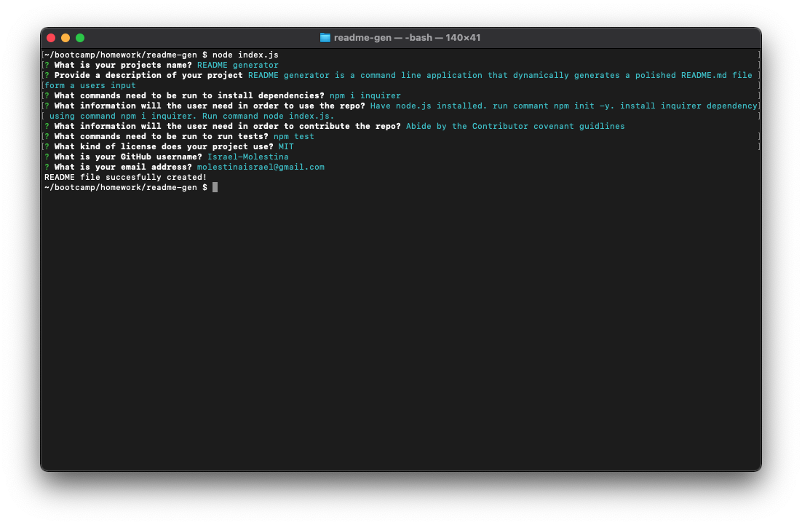

# README generator


## User Story

AS A developer I WANT a README generator SO THAT I can quickly create a professional README for a new project.

## Description

README Generator is a command-line application that will dynamically generate a polished and professional README.md file from a user's input. The generator will use the Inquirer package.

## Table of Contents

- [Installation](#Installation)

- [Usage](#Usage)

- [License](#License)

- [Contributing](#Contributing)

- [Tests](#Tests)

- [Questions](#Questions)

## Installation

To install the required dependencies, please run the following command:

```
npm i inquirer
```

## Usage

In order to run and use the application you will need to have node.js installed. Then run the command node index.js to start the application. You will be presented with various prompts asking about your project. Once all prompts are answered the application will generate a README.md file for you. The file will have a functional table of contents, a badge and link to the license you chose, your email and your GitHub link. The file called SAMPLEREADME.md was generated using this application. Below is a link to a walkthrough video.

[Walkthrough](https://youtu.be/y9A2gxdbOLo)

## License

This project is licensed under the [MIT](https://spdx.org/licenses/MIT.html) license.

## Contributing

Abide by the Contributor covenant guidelines

## Tests

To run tests, please run the following command:

```
npm test
```

## Screenshots

### Command-Line Prompts



###

## Questions

If you have any questions, contact me at zocrates@gmail.com. You can find more of my work at [Andres-Molestina](https://github.com/zocartes)
